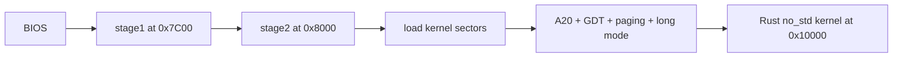
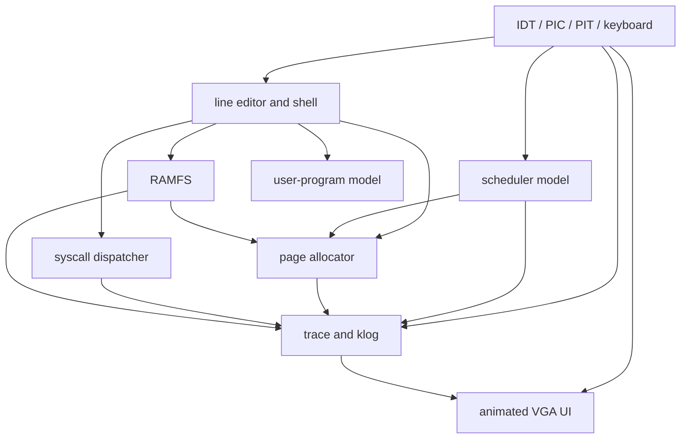

# Nagi OS Architecture

## Boot path

The build compiles the Rust ELF, converts it to a flat binary, passes the exact
sector count to NASM, and assembles a 1.44 MiB floppy image. stage1 loads the
fixed-size stage2 area; stage2 loads the generated kernel length and enters
x86_64 long mode.

## Runtime relationships

## Subsystems

| Subsystem | Main file | Responsibility |
|---|---|---|
| Boot | `boot/stage1.asm`, `boot/stage2.asm` | Disk load and CPU mode transition |
| Interrupts | `kernel/src/idt.rs`, `pic.rs`, `pit.rs` | Exceptions, IRQ routing, timebase |
| Input | `kernel/src/keyboard.rs` | Scancodes, editing, history, completion |
| UI/shell | `kernel/src/ui.rs`, `shell.rs` | VGA workspace and command pages |
| Memory | `kernel/src/mem.rs` | Page pool, ownership, fragmentation metrics |
| Tasks | `kernel/src/task.rs` | Round-robin states and runtime accounting |
| Syscalls | `kernel/src/syscall.rs` | Dispatch, results, per-call statistics |
| Files | `kernel/src/fs.rs` | Single-directory RAMFS and metadata |
| Observation | `kernel/src/trace.rs`, `klog.rs` | Event rings, replay, timeline |

## Important invariants

- Reserved pages are owned by `Kernel` and cannot be freed.
- Every task stack and RAMFS file page has a matching allocator owner.
- Exactly one schedulable task is Running; Sleeping tasks are skipped.
- Unknown syscall numbers return `ENOSYS` and leave the kernel running.
- Command output uses the content column and cannot overwrite the sidebar.
- Watch refresh occurs only from timer IRQs and stops on a normal command.

## Honest scope

Nagi OS performs a real BIOS boot, long-mode transition, interrupt setup,
timer/keyboard IRQ handling, VGA I/O, serial I/O, and bare-metal Rust
execution. Task context switches and user programs are currently observable
models inside ring 0; they are not yet separate ring-3 processes. RAMFS is
fixed-capacity and non-persistent. These are explicit extension boundaries.
